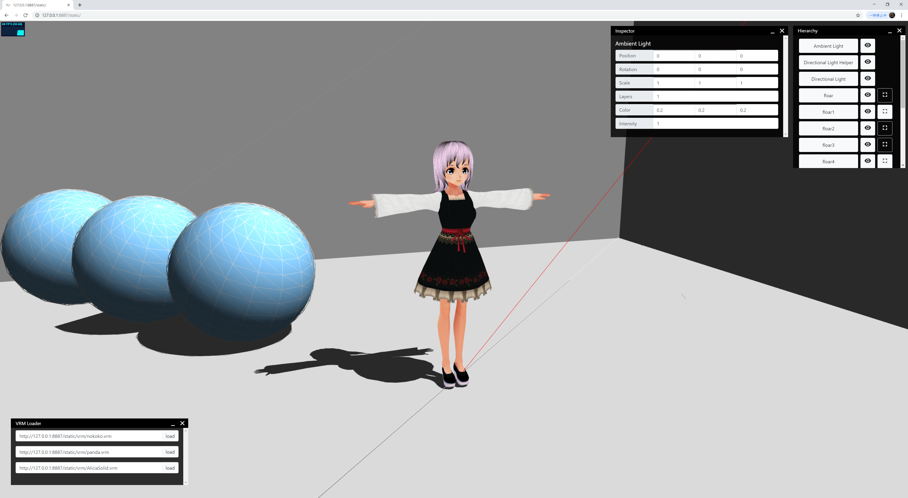
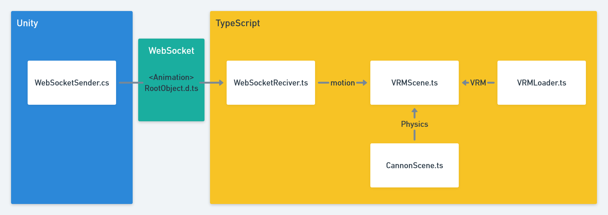

# ts-vrm

ts-vrm is sample code for loading VRM File.

## Examples

1. `static/index.html`

## Libraries Used

-   [three.js](https://threejs.org/)
-   [Cannon.js](http://www.cannonjs.org/)

## UML

   
  <a href=""><strong>Takenoko Tech.</strong></a>

